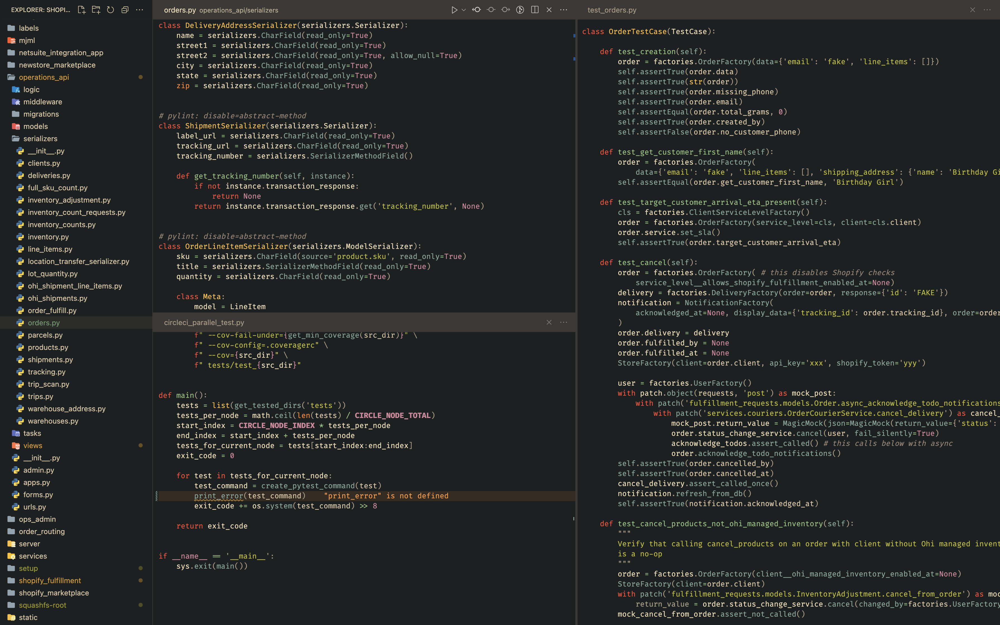

Let's start by removing the sidebar and the status bar. They take up space on the screen and do not provide any useful information. Open the settings file:  ( if you are on _Windows_ or _Linux_) and type _Open settings (JSON)_. In the file that opens, we will add our settings:

```json
{
"workbench.activityBar.visible": false,
"workbench.statusBar.visible": false,
}
```

Panels can be accessed from the keyboard:
+  - open file in project
+  - enable or disable the sidebar
+  - navigation bar for project files
+  - search bar in files
+  - debug panel
+  - extensions panel
+  - repositories panel

### Tabs

Disable tabs and additional information displayed on them.

```json
"workbench.editor.showTabs": false,
"workbench.editor.tabCloseButton": "off",
"workbench.editor.showIcons": false,
"workbench.editor.decorations.badges": false,
"workbench.editor.decorations.colors": false,
```

You can move between editor groups using ,  keys and so on (if the group has not been opened, it will be created). You can open a tab in the active editor group with  or ,  and so on.

### Panels

Let's remove unnecessary arrows and nesting level indicators for panels displaying trees (file navigation, commits, and so on). Also, install nice [icons](https://marketplace.visualstudio.com/items?itemName=PKief.material-icon-theme).

```json
"workbench.iconTheme": "material-icon-theme",
"workbench.tree.renderIndentGuides": "none",
"material-icon-theme.hidesExplorerArrows": true,
```

Clean up the Files panel:

``` json
"explorer.excludeGitIgnore": true,
"explorer.openEditors.visible": 0,
"explorer.confirmDragAndDrop": false,
"explorer.autoReveal": false,
```

## Editor

Now let's move on to the main file editor. It contains a lot of visual noise.

```json
"editor.minimap.enabled": false,
"editor.renderWhitespace": "none",
```

Turn off the highlighting of the active line and other noise:

```json
"editor.renderLineHighlight": "none",
"editor.overviewRulerBorder": false,
"editor.hideCursorInOverviewRuler": true,
"editor.occurrencesHighlight": false,

// Scrollbars
"editor.scrollbar.horizontal": "hidden",
"editor.scrollbar.vertical": "auto",
"editor.scrollbar.verticalScrollbarSize": 6,

// Misc
"editor.guides.indentation": false,
"editor.folding": false,
"editor.glyphMargin": false,
"editor.lineNumbers": "off",
```

Font. Here you can customize it as you like:

```json
"editor.fontFamily": "Fira Code",
"editor.fontLigatures": true,
"editor.fontSize": 13,
"editor.lineHeight": 18,
```

## Breadcrumbs

Disable breadcrumbs:

```json
"breadcrumbs.enabled": false,
"breadcrumbs.icons": false,
```